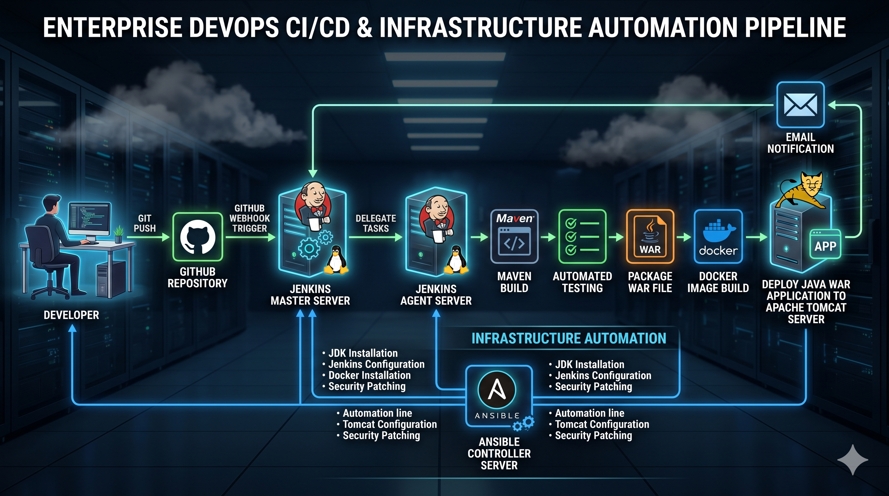
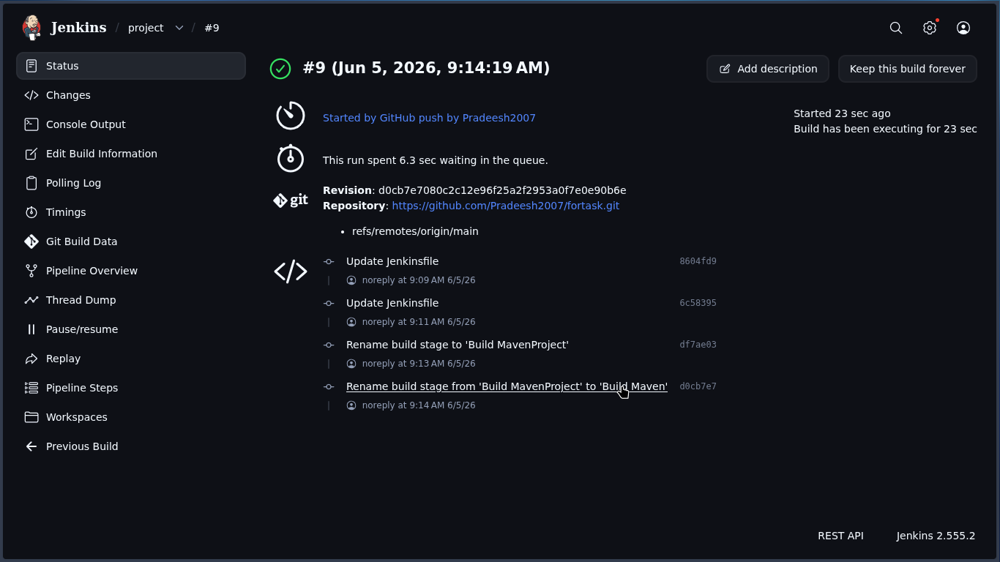
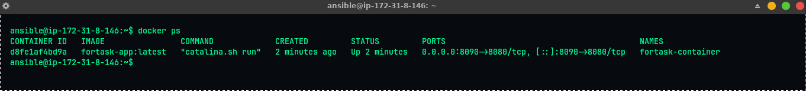
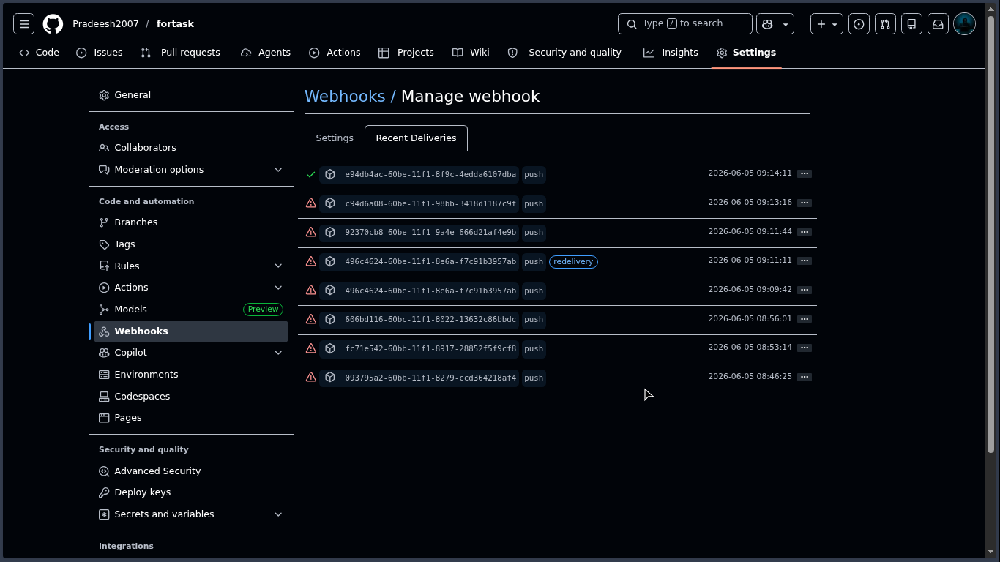
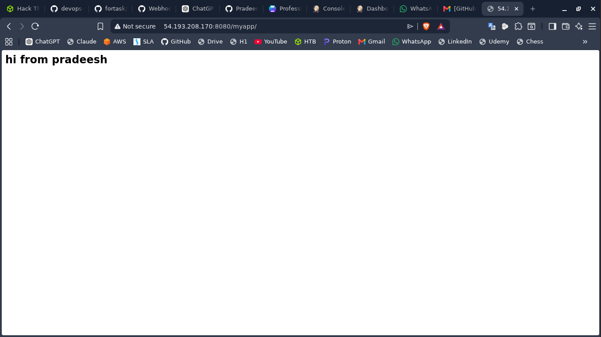

# 🚀 End-to-End DevOps CI/CD Automation Pipeline

## 📌 Project Overview

This project demonstrates a complete real-world DevOps CI/CD automation pipeline built using multiple Linux servers and industry-standard DevOps tools.

The pipeline automatically builds, tests, containerizes, and deploys a Java Maven application whenever code changes are pushed to GitHub using GitHub Webhooks and Jenkins Pipelines.

The project focuses on:

- Infrastructure Automation
- Continuous Integration & Continuous Deployment (CI/CD)
- Docker Containerization
- Remote Deployment Automation
- DevOps Best Practices

## Architecture Diagram:

---

# 🏗️ Infrastructure Architecture

```text
                 Developer
                     │
                     ▼
              GitHub Repository
                     │
              (Webhook Trigger)
                     │
                     ▼
               Jenkins Master
                     │
             Trigger Build Job
                     │
                     ▼
               Jenkins Slave
          ┌───────────────────┐
          │ Maven Build       │
          │ Docker Build      │
          │ Docker Run        │
          └───────────────────┘
                     │
                     ▼
              Remote Tomcat
               Deployment
                     │
                     ▼
             Email Notification
```

---

# 🖥️ Infrastructure Setup

| Server | Purpose |
|--------|---------|
| VM1 | Ansible Controller |
| VM2 | Jenkins Master |
| VM3 | Jenkins Slave/Agent |
| VM4 | Apache Tomcat Server |

---

# ⚙️ Technologies Used

## DevOps Tools

- Jenkins
- Ansible
- Docker
- Apache Tomcat
- Maven
- GitHub Webhooks

## Cloud & Infrastructure

- Linux
- SSH
- Bash Scripting

## CI/CD & Automation

- Jenkins Declarative Pipeline
- Infrastructure as Code (IaC)
- Automated Deployment

---

# 🔄 CI/CD Workflow

1. Developer pushes code changes to GitHub
2. GitHub Webhook automatically triggers Jenkins Pipeline
3. Jenkins pulls latest source code
4. Maven builds and packages the application
5. Docker image is built
6. Existing container is stopped and removed
7. New Docker container is deployed
8. WAR file is copied to remote Tomcat server
9. Jenkins sends success/failure email notification

---

# 📂 Project Structure

```bash
devops-cicd-automation-project/
│
├── ansible/
│   ├── install_jenkins.yml
│   ├── install_tomcat.yml
│   ├── install_docker.yml
│   └── inventory
│
├── jenkins/
│   └── Jenkinsfile
│
├── docker/
│   └── Dockerfile
│
├── shellscripts/
│   ├── usercreate.sh
│   └── keyscript.sh
│
├── application/
│   ├── pom.xml
│   └── src/
│
├── screenshots/
│   ├── jenkins-success.png
│   ├── docker-container.png
│   ├── tomcat-deployment.png
│   └── webhook-trigger.png
│
└── README.md
```

---

# 🔧 Jenkins Pipeline Stages

## ✅ Checkout Source Code

Pulls latest source code from GitHub repository.

---

## ✅ Maven Build

Builds the Java application using Maven.

```bash
mvn clean package -DskipTests
```

---

## ✅ Verify Artifact

Verifies generated WAR artifact.

---

## ✅ Docker Build

Builds Docker image for application deployment.

```bash
docker build -t fortask-app:latest .
```

---

## ✅ Stop Existing Container

Stops and removes old running container.

---

## ✅ Run Docker Container

Deploys updated Docker container.

```bash
docker run -d -p 8090:8080 fortask-app:latest
```

---

## ✅ Deploy to Remote Tomcat

Copies WAR artifact to remote Tomcat server using SCP.

---

## ✅ Email Notification

Sends pipeline success/failure notifications automatically.

---

# 📜 Sample Jenkins Pipeline

```groovy
pipeline {

    agent {
        label 'slave'
    }

    stages {

        stage('Checkout') {
            steps {
                git branch: 'main',
                url: 'https://github.com/Pradeesh2007/fortask.git'
            }
        }

        stage('Build Maven') {
            steps {
                sh 'mvn clean package -DskipTests'
            }
        }

        stage('Build Docker Image') {
            steps {
                sh 'docker build -t fortask-app:latest .'
            }
        }
    }
}
```

---

# 🐚 Shell Scripts Used

## 👤 User Creation Script

This script automates Linux user creation, sudo privilege assignment, and SSH configuration.

```bash
#!/usr/bin/env bash
set -euo pipefail

echo "Creating a new user..."

read -rp "Enter the username: " username

if [[ ! "$username" =~ ^[a-z_][a-z0-9_-]*$ ]]; then
    echo "Invalid username."
    exit 1
fi

if id "$username" &>/dev/null; then
    echo "User '$username' already exists."
    exit 1
fi

sudo adduser "$username"
sudo usermod -aG sudo "$username"

sudo bash -c "cat > /etc/sudoers.d/$username" <<EOF
$username ALL=(ALL:ALL) NOPASSWD:ALL
EOF

sudo chmod 440 "/etc/sudoers.d/$username"
sudo visudo -cf "/etc/sudoers.d/$username"

SSH_CONF="/etc/ssh/sshd_config.d/60-cloudimg-settings.conf"

sudo mkdir -p /etc/ssh/sshd_config.d

echo "PasswordAuthentication yes" | sudo tee "$SSH_CONF" >/dev/null

if systemctl list-units --type=service | grep -q ssh.service; then
    sudo systemctl restart ssh
elif systemctl list-units --type=service | grep -q sshd.service; then
    sudo systemctl restart sshd
fi

echo "User '$username' created successfully."
```

### Usage

```bash
git clone https://github.com/Pradeesh2007/shell.git
chmod +x shell/usercreate.sh
./shell/usercreate.sh
```

---

## 🔑 SSH Key Copy Script

This script generates SSH keys and copies them to remote servers for passwordless authentication.

```bash
#!/usr/bin/env bash
set -euo pipefail

echo "Generating SSH key if it does not already exist..."

KEY_PATH="${HOME}/.ssh/id_ed25519"

if [[ ! -f "${KEY_PATH}" ]]; then
    ssh-keygen -t ed25519 -f "${KEY_PATH}" -N ""
    echo "SSH key created at ${KEY_PATH}"
else
    echo "SSH key already exists at ${KEY_PATH}"
fi

if [[ $# -eq 0 ]]; then
    echo "Usage: $0 user@host1 [user@host2 ...]"
    exit 1
fi

echo ""
echo "Copying public key to servers..."

for host in "$@"; do
    echo "----------------------------------------"
    echo "Copying key to: ${host}"
    ssh-copy-id -i "${KEY_PATH}.pub" "${host}"
    echo "Done for ${host}"
done

echo ""
echo "All keys copied successfully."
```

### Usage

```bash
git clone https://github.com/Pradeesh2007/Shellscripts.git
chmod +x Shellscripts/keyscript.sh
./Shellscripts/keyscript.sh user@host
```

---

# 📸 Screenshots

## Jenkins Pipeline



---

## Docker Container Running



---

## GitHub Webhook Trigger



---

## Tomcat Deployment

_

---

# 🚀 How to Run the Project

## Clone Repository

```bash
git clone https://github.com/Pradeesh2007/fortask.git
```

---

## Build Application

```bash
mvn clean package
```

---

## Build Docker Image

```bash
docker build -t fortask-app .
```

---

## Run Docker Container

```bash
docker run -d -p 8090:8080 fortask-app
```

---

# 🔐 Security & Best Practices

- SSH-based remote deployment
- Automated deployment pipeline
- Multi-server architecture
- Infrastructure automation using Ansible
- Environment variable usage inside Jenkins
- Email alert system for monitoring build status

---

# 📈 Future Improvements

- Kubernetes Deployment
- Helm Charts
- SonarQube Integration
- Trivy Security Scanning
- Nexus Artifact Repository
- Prometheus Monitoring
- Grafana Dashboards
- ArgoCD GitOps Deployment

---

# 🎯 Project Outcome

Successfully implemented a fully automated end-to-end DevOps CI/CD pipeline capable of:

- Continuous Integration
- Automated Build & Deployment
- Containerized Application Deployment
- Remote Server Automation
- Infrastructure Provisioning
- Deployment Monitoring & Notifications

---

# 👨‍💻 Author

## PRADEESH KUMAR

### Cloud | DevOps | Cloud Security Enthusiast

- GitHub: https://github.com/Pradeesh2007
- LinkedIn: https://www.linkedin.com/in/pradeesh-the-clouder

---

# ⭐ If you found this project useful, give it a star!
